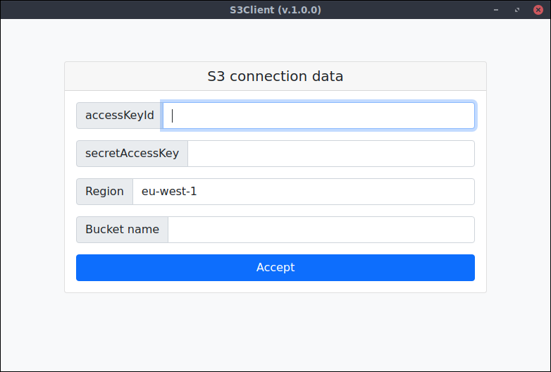
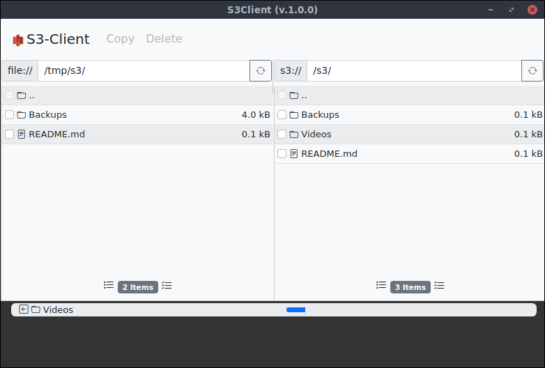

# s3 Client
**A free Amazon AWS s3 graphical client**
## Description

This project is a simple s3 client to work with Amazon s3 Buckets. This app's allows you to upload, download and delete s3 content.
Works with Windows, Linux and Mac (x86 and ARM architecture).

This App uses [Electron](https://www.electronjs.org/) as a solution to create a cross-platform desktop binaries.

## Installation

Binaries can be downloaded from GitHub at https://github.com/m0rtadelo/s3client/releases/

## Execution
App can be executed within the source code. Steps:
### Clone this repository
* `git clone https://github.com/m0rtadelo/s3client .`
### Install dependencies
* `npm run instal`
### Transpile Typescript and Execute
* `npm run start`

## CI/CD Integration
This project uses CI/CD workflow thanks to GitHub Actions. The code is compiled and released every new tag based on https://trstringer.com/github-actions-create-release-upload-artifacts/.
### Publish new release
Steps to publish a new release:
* `git tag X.X.X`
* `git push --tags`
> X.X.X is the Release version number

## Issues
Issues should be open on the Issues section of this repo (https://github.com/m0rtadelo/s3client/issues)
